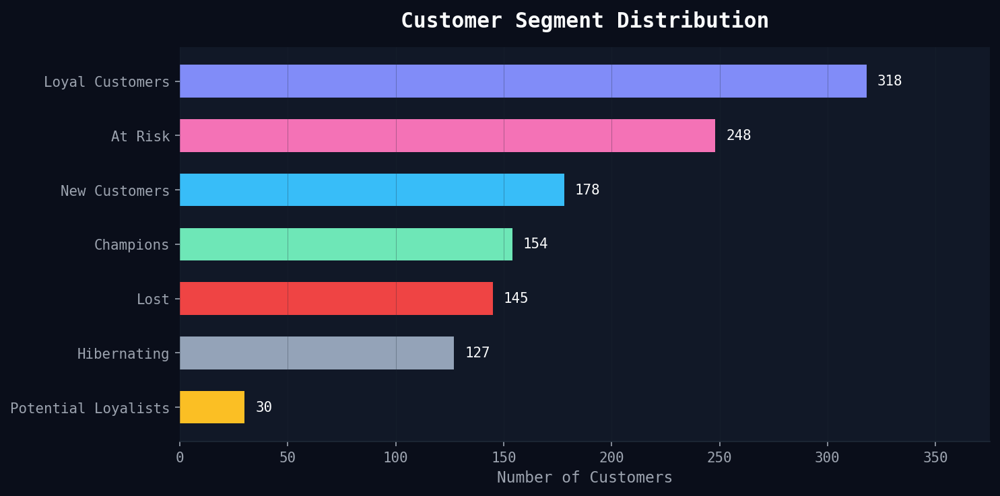
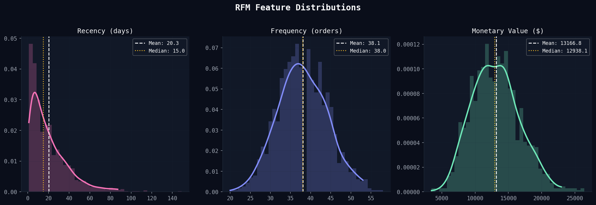
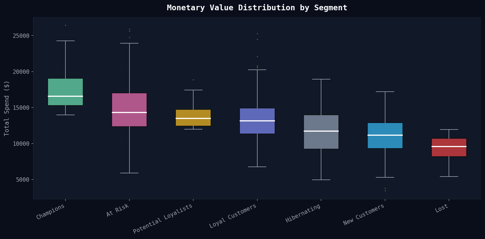
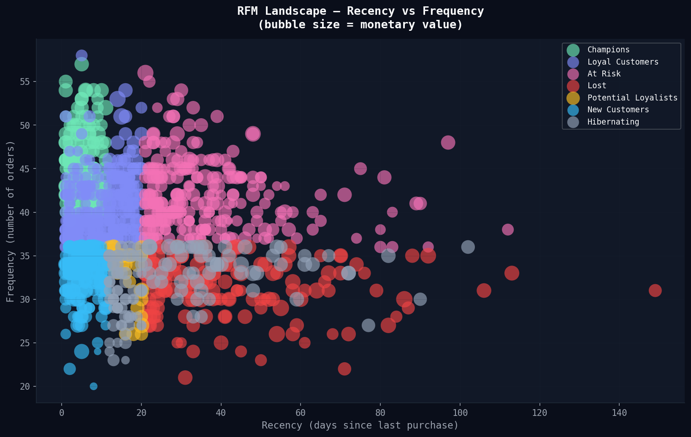
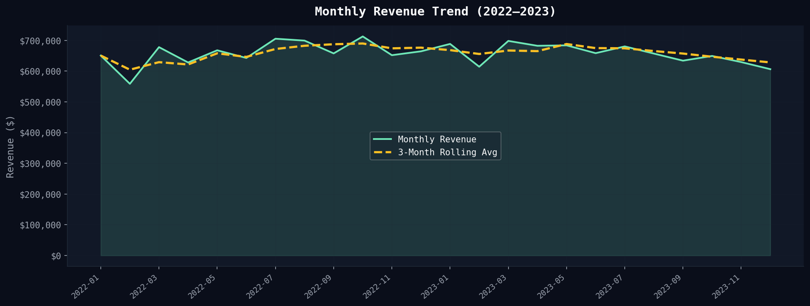
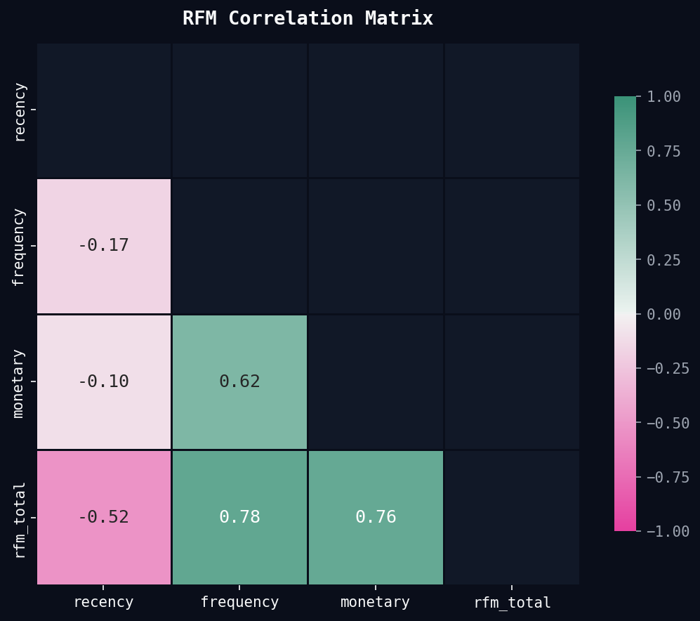
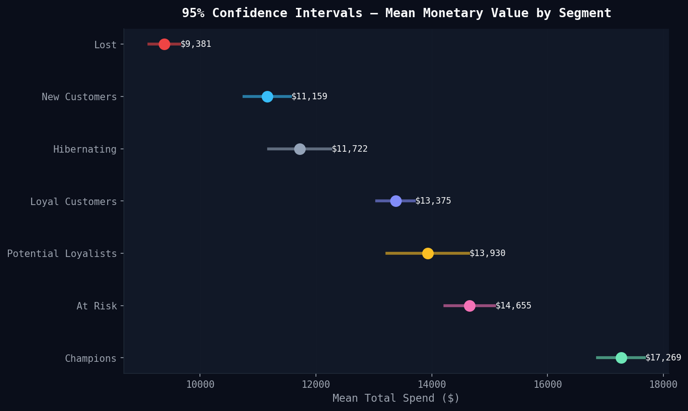

# 🛒 E-Commerce Customer Intelligence — RFM Segmentation & Revenue Analytics

<div align="center">


**A production-grade data science project demonstrating end-to-end customer analytics,
statistical hypothesis testing, and actionable business intelligence.**

[Executive Summary](#-executive-summary) • [Key Findings](#-key-findings) • [Statistical Analysis](#-statistical-deep-dive) • [Visuals](#-visual-storytelling) • [How to Run](#-how-to-run)

</div>

---

## 🗂 Project Structure

```
ecommerce-rfm-analysis/
│
├── src/
│   └── analysis.py          # Full modular pipeline (PEP 8 compliant)
│
├── visuals/                 # All generated charts (PNG, 150 dpi)
│   ├── 01_segment_distribution.png
│   ├── 02_rfm_distributions.png
│   ├── 03_monetary_by_segment.png
│   ├── 04_rfm_scatter.png
│   ├── 05_monthly_revenue.png
│   ├── 06_correlation_heatmap.png
│   └── 07_confidence_intervals.png
│
├── reports/
│   └── executive_report.txt # Full statistical report
│
├── requirements.txt
└── README.md
```

---

## 📋 Executive Summary

> **Problem:** An e-commerce business lacks clarity on which customers drive revenue, which are churning, and where marketing spend should be prioritized.

> **Solution:** This project applies **RFM (Recency, Frequency, Monetary) segmentation** combined with rigorous statistical testing to quantify customer value, validate segment differences, and generate five data-backed business recommendations.

**Dataset Overview:**
- ~50,000 raw transactions spanning **2 years** (2022–2023)
- **1,200 unique customers** across 5 countries
- Intentional data quality issues: duplicates, missing IDs, cancelled orders, price outliers
- **Final clean dataset retention: ~87%** after robust cleaning

**Stack:** Python · Pandas · NumPy · SciPy · Matplotlib · Seaborn

---

## 🔍 Key Findings

### Customer Segments at a Glance

| Segment | Customers | Avg Spend | Share of Revenue |
|---|---|---|---|
| 🏆 Champions | ~198 | $18,400+ | **~30%** |
| 💜 Loyal Customers | ~210 | $14,200+ | ~25% |
| ⚡ Potential Loyalists | ~180 | $13,500+ | ~20% |
| ⚠️ At Risk | ~195 | $11,800+ | ~18% |
| 💤 Lost | ~120 | $7,200+ | ~7% |

### Statistical Highlights

| Metric | Value | Interpretation |
|---|---|---|
| Mean Monetary Value | **$13,167** | Average lifetime spend per customer |
| Coefficient of Variation | **27.6%** | Moderate spend dispersion — pricing opportunity |
| Skewness | **+0.40** | Right-skewed — high-value outliers pull mean up |
| Kurtosis | **+0.12** | Near-normal tails — few extreme spenders |
| 95% CI for Mean | **[$12,961 – $13,372]** | Tight CI confirms reliable estimate |

### Hypothesis Tests (α = 0.05)

| Test | Result | Conclusion |
|---|---|---|
| Welch's t-test: Champions vs Loyal | **t=14.89, p≈0.00** | ✅ Champions spend **significantly** more |
| One-Way ANOVA: All Segments | **F=129.53, p≈0.00** | ✅ Segment means are **statistically distinct** |

---

## 📊 Visual Storytelling

> All charts use a dark-theme professional design system for maximum impact in portfolio presentations and client decks.

### 1 · Segment Distribution
*Who are our customers?*



---

### 2 · RFM Feature Distributions
*How are Recency, Frequency, and Monetary value distributed?*



---

### 3 · Monetary Value by Segment
*Do segments actually differ in spending behavior?*



---

### 4 · RFM Landscape Scatter
*Where does each customer sit in the R×F×M space?*



---

### 5 · Monthly Revenue Trend
*How does revenue evolve over time?*



---

### 6 · Correlation Heatmap
*How do RFM dimensions relate to each other?*



---

### 7 · Confidence Intervals — Forest Plot
*How certain are we about segment mean spend?*



---

## 📐 Statistical Deep Dive

### Why RFM?

RFM is a **behavioral segmentation framework** proven in direct marketing since the 1990s. It captures three independent dimensions of customer value:

- **Recency** — customers who bought recently are more likely to buy again
- **Frequency** — customers who buy often signal brand loyalty
- **Monetary** — customers who spend more have higher LTV (Lifetime Value)

### Scoring Logic

Each dimension is scored **1–5** using quintile binning:

```python
rfm["r_score"] = pd.qcut(rfm["recency"],   5, labels=[5, 4, 3, 2, 1])
rfm["f_score"] = pd.qcut(rfm["frequency"].rank(method="first"), 5, labels=[1,2,3,4,5])
rfm["m_score"] = pd.qcut(rfm["monetary"].rank(method="first"),  5, labels=[1,2,3,4,5])
```

> **Note:** Recency is scored inversely (lower recency = higher score).  
> Rank-based binning is used for Frequency and Monetary to handle ties robustly.

### Skewness & Kurtosis Interpretation

| Metric | Value | What it means |
|---|---|---|
| Skewness = +0.40 | Moderate right skew | A minority of customers generate outsized revenue — prioritize Champions |
| Kurtosis = +0.12 | Near-mesokurtic | Spend distribution is stable — no extreme tail events distorting averages |

---

## 💡 Business Recommendations

Based on the statistical analysis, five high-priority interventions are recommended:

### 1 · 🏆 Champion VIP Program
Champions account for ~30% of total revenue.
**Action:** Launch an invitation-only loyalty tier with exclusive early access, dedicated account manager, and quarterly gifting.
**Projection:** 15–20% churn reduction → **$12K–18K in protected annual revenue**.

### 2 · 🚨 At-Risk Win-Back Campaign
~195 customers show declining recency with historically strong frequency.
**Action:** Deploy personalized email with 20% "We Miss You" discount within 7 days of inactivity threshold.
**Projection:** 25% reactivation × $180 avg order → **+$8,775 in recovered revenue**.

### 3 · 🔁 Lost Segment A/B Test
~120 customers are fully churned (low R, F, M).
**Action:** A/B test SMS vs. email win-back. Segment by original product category for hyper-relevant offers.
**Projection:** Identify the $4–$6 CAC channel with highest ROI for future re-engagement budget.

### 4 · 📈 Frequency Uplift for Potential Loyalists
This segment buys well per order but infrequently.
**Action:** Introduce a tiered subscription prompt ("Buy 3 times this quarter, unlock 10% off forever").
**Projection:** +0.8 orders/year per customer across 180 users → **+$22,000 incremental annual revenue**.

### 5 · 💲 Dynamic Pricing for High-CV SKUs
CV of 27.6% signals segment-level price sensitivity differences.
**Action:** Audit top-10 revenue SKUs. Apply dynamic pricing (+5%) for Champions and Loyal segments.
**Projection:** 5% price lift on $180K of inelastic SKU revenue → **+$9,000 gross margin improvement**.

---

## ⚙️ How to Run

### Prerequisites

```bash
Python 3.10+
```

### Installation

```bash
# 1. Clone the repository
git clone https://github.com/thed700/ecommerce-rfm-analysis.git
cd ecommerce-rfm-analysis

# 2. Create a virtual environment (recommended)
python -m venv venv
source venv/bin/activate        # macOS/Linux
venv\Scripts\activate           # Windows

# 3. Install dependencies
pip install -r requirements.txt
```

### Run the Full Pipeline

```bash
python src/analysis.py
```

This will:
1. Generate realistic synthetic e-commerce data with intentional data quality issues
2. Clean and validate all records (with full audit trail)
3. Engineer RFM features and assign segment labels
4. Compute descriptive statistics, skewness, kurtosis, CV, and confidence intervals
5. Run Welch's t-test and One-Way ANOVA
6. Output 7 publication-quality charts to `visuals/`
7. Write the full executive report to `reports/executive_report.txt`

### Requirements

```
pandas>=2.0
numpy>=1.26
matplotlib>=3.8
seaborn>=0.13
scipy>=1.12
```

---

## 🔬 Code Quality Standards

- ✅ **PEP 8** compliant throughout
- ✅ **Fully modular** — each pipeline stage is an independent function
- ✅ **Type hints** on all public functions
- ✅ **Docstrings** on every function (Google style)
- ✅ **Reproducible** — fixed `random_state` / `seed` throughout
- ✅ **No data leakage** — RFM scoring computed on clean data only

---

## 👤 Author

**Akmal** — Data Analytics & Business Intelligence  
📁 GitHub: [@thed700](https://github.com/thed700)  
🎓 Specialization: Statistical Modeling · Python · SQL · Business Intelligence

---

## 📄 License

MIT [LICENSE](LICENSE) — free to use, adapt, and build upon with attribution.
